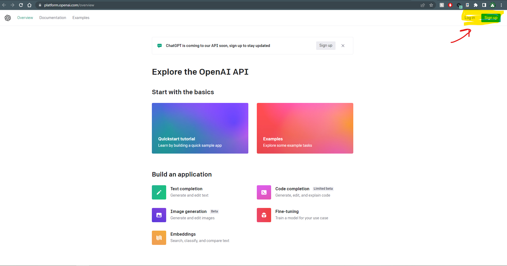
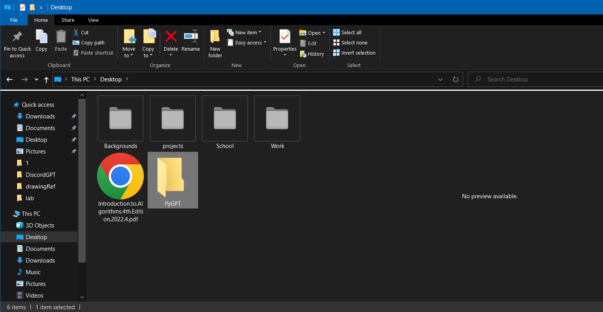
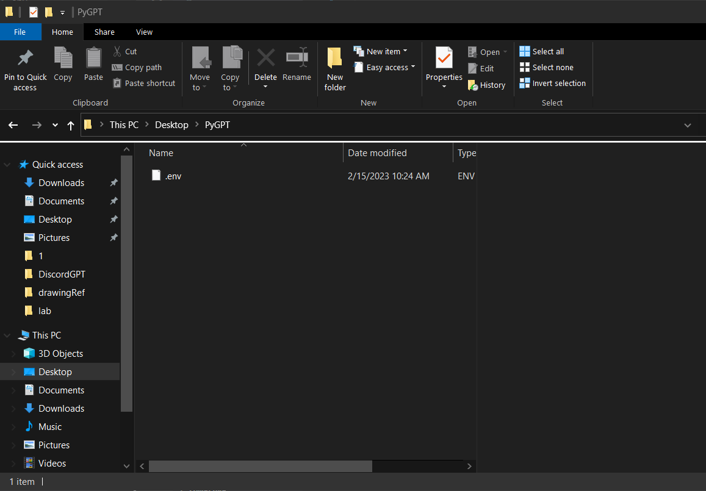
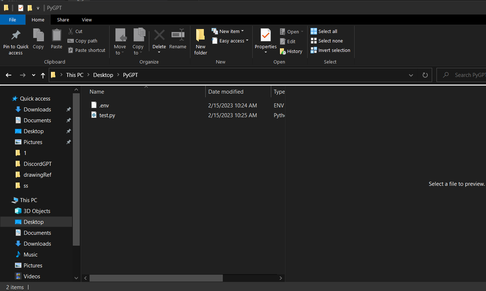

### @Author: Sam DeFrancisco [LinkedIn](https://www.linkedin.com/in/sam-defrancisco-4373361b3/) [Github](https://www.github.com/sjdefran1)

---

# Connecting to ChatGPT W/ Python

## Prerequistes For Project

- Working Python Installation on your device
- PIP (python package manager)
  - Knowledge of python as well as PIP

> Throughout this tutorial I will be assuming the reader knows how to setup their own development enviroment. If the reader needs assistance installing python/pip they sould **refer to links below.**

[Python Windows Install](https://www.digitalocean.com/community/tutorials/install-python-windows-10) | [Python Mac Install](https://www.dataquest.io/blog/installing-python-on-mac/) | [Python Linux Install](https://docs.python-guide.org/starting/install3/linux/)

[PIP Windows Install](https://www.geeksforgeeks.org/how-to-install-pip-on-windows/) | [PIP Mac Install](https://www.geeksforgeeks.org/how-to-install-pip-in-macos/) | [PIP Linux Install](https://www.tecmint.com/install-pip-in-linux/)

## Introduction

Today we will creating a simple python script that can connect to ChatGPT. ChatGPT is a AI model created by OpenAI that is capable of incredible things. GPT accepts prompts from the user and generates responses. Using Python we can create a starting point for taking advantage of this incredible technology. While this is just a starting point hopefully it sparks your creativity for things that could be automated using these two technologies. Lets get started!

---

# Setting up ChatGPT

## Prereqs

- OpenAI account

## Generate an API Key

To be able to connect to ChatGPT using Python we will need an API key, this will uniquely identify our OpenAI account to the code we are writing.

**continued on next page**

---

<br>
<br>
<br>
<br>
<br>
<br>
<br>

## First navigate to [OpenAi Homepage](https://platform.openai.com/overview)

</img>

<!--  -->
<br>

- In the top right of the screen, click login and enter your credentials.
  > You may have to verify that you are a human
- Once logged in, click on your account once again in the top right.

  - From the dropdown, choose **View API Keys**
  - In the middle of your screen click **Create New Secret Key**

    > **This key will only be displayed once!** It is important that you save it somewhere right away before clicking out of the popup

    **If something goes wrong you can always create a new API key**

### <span style="color: #fc727b">**It is very important that you never share your API key w/ anyone else!**</span>

---

## Lets Make Sure Our Key is Working!

- First lets install the necessary packages to test out our key
  - Within your **console** enter the following pip installs
    ```bash
    pip install openai
    ```
    ```bash
    pip install python-dotenv
    ```
- Create a folder wherever you would like this to live, I'm calling mine PyGPT
  </img>

<!--  -->

- Now create a file called **.env** inside of your folder.



- Inside **.env** add your api key as follows

  ```
  OPENAI_API_KEY={Your api key}
  ```

  > Make sure to replace {your api key} with the key we just generated, **do not include the brackets**

---

## Create a new **python file called test.py** inside this same directory



---

## Adding code to test.py

- Import the necessary packages by adding the following lines **into test.py**

  ```python
  import os
  import openai
  from dotenv import load_dotenv
  ```

- Next we are going to load our .env file **into test.py** using dotenv
  ```python
  load_dotenv()
  ```

## Now the fun part, lets connect to ChatGPT and generate our first response!

> Inside **test.py** lets add the following code

```python
# Load in our API key, because of dotenv we don't have to mess with our actual
# System variables, it loads them in itself
openai.api_key = os.getenv("OPENAI_API_KEY")

# Create a string that holds our prompt
# The prompt can be whatever you'd like
gpt_prompt = "Say hello five different ways"

# Now for the actual query
# While this might look a little overwhelming it isn't anything to bad
# The two most import parts here are our engine & prompt
# engine: refers to the data model we are accessing
# prompt: our prompt string, what we are asking GPT
response = openai.Completion.create(
  engine="text-davinci-002",
  prompt=gpt_prompt,
  temperature=0.5,
  max_tokens=256,
  top_p=1.0,
  frequency_penalty=0.0,
  presence_penalty=0.0
)

# print the response from GPT to the console
# response has a lot of extra information included in it, to access just the response
# we index it in this way
print(response['choices'][0]['text'])
```

## For reference, here is the entire **test.py**

```py
import os
import openai
from dotenv import load_dotenv
load_dotenv()

openai.api_key = os.getenv("OPENAI_API_KEY")
gpt_prompt = "Say hello five different ways"

response = openai.Completion.create(
  engine="text-davinci-002",
  prompt=gpt_prompt,
  temperature=0.5,
  max_tokens=256,
  top_p=1.0,
  frequency_penalty=0.0,
  presence_penalty=0.0
)

print(response['choices'][0]['text'])

```

---

<br>
<br>
<br>

---

## Final Results

### If all goes well here, when we run test.py we should get our response **printed to the console**, heres mine!

- Within your **console** type

```
python test.py
```

### **Response**

```
Hello,

Hi,

Hey,

What's up,

Yo.
```

---

## Lets use our script to generate some ideas for where we could go from here!

```
gpt_prompt = 'generate different ideas for automating stuff using python and the text-davinci-002 model.'
```

### **Response**

```
Sure, here are some ideas for automating tasks using Python and connecting to the Davinci 002 text model:

Text summarization: Use the Davinci 002 text model to generate summaries of articles or documents for various applications, such as research or news reporting. Use Python to automate the process of text summarization and integrate it with other systems.

Sentiment analysis: Use the Davinci 002 text model to analyze text data and determine sentiment for various applications, such as brand monitoring or market research. Use Python to automate the process of sentiment analysis and integrate it with other systems.

Named entity recognition: Use the Davinci 002 text model to identify named entities in text for various applications, such as information extraction or document tagging. Use Python to automate the process of named entity recognition and integrate it with other systems.

Language translation: Use the Davinci 002 text model to develop language translation software for various applications, such as website localization or document translation. Use Python to automate the process of language translation and integrate it with other systems.

Text classification: Use the Davinci 002 text model to classify text for different applications, such as spam filtering or topic modeling. Use Python to automate the process of text classification and integrate it with other systems.

Question-answering: Use the Davinci 002 text model to develop question-answering systems for various applications, such as customer support or chatbots. Use Python to automate the process of question-answering and integrate it with other systems.

Chatbot development: Use the Davinci 002 text model to train a chatbot for various applications, such as customer support or personal assistance. Use Python to integrate the chatbot with messaging platforms or other systems.

Content generation: Use the Davinci 002 text model to generate content for various applications, such as marketing or social media. Use Python to automate the process of content generation and integrate it with other systems.

These are just a few ideas for automating tasks using Python and the Davinci 002 text model. With the flexibility and power of the model, there are many more possibilities for automation and integration with various systems.
```

---

## Congratulations, have fun messing with different prompts and see the power of ChatGPT!

Interested in going a step further? Check out this github repo for creating a discord bot using the script we just created! [DiscordBot](https://github.com/sjdefran1/DiscordGPT), main python script here [discordBot.py](https://github.com/sjdefran1/DiscordGPT/blob/main/discordBot.py).

<!-- # Discord

> [Discord Developer Getting Started Guide](https://discord.com/developers/docs/getting-started), information below could become deprecated, this link should always have the most up-to-date information

## Prereqs

- Discord Account

## Steps

1. Create discord server
2. Open discord developer dashboard
3. Create Application
4. Create Bot
5. Generate Bot url link
   1. Paste link into browser to activate -->
